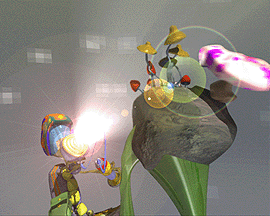



## File Association

### Description

File Association can be tricky and there are some rather blunt instruments being applied in some examples of Association both on this site and elsewhere on the web. This demo shows how to Associate your App to a file extension and safely return Association to the previously Associated program if desired. Lots of comments, easy to call, with the absolute minimum of code required to do the job. Prompted by more than one question in the Discussion Forum.
 
### More Info
 

             |
---                |---
**Submitted On**   |2002-08-29 11:39:02
**By**             |[MrBobo](https://github.com/Planet-Source-Code/PSCIndex/blob/master/ByAuthor/mrbobo.md)
**Level**          |Beginner
**User Rating**    |5.0 (35 globes from 7 users)
**Compatibility**  |VB 6\.0
**Category**       |[Registry](https://github.com/Planet-Source-Code/PSCIndex/blob/master/ByCategory/registry__1-36.md)
**World**          |[Visual Basic](https://github.com/Planet-Source-Code/PSCIndex/blob/master/ByWorld/visual-basic.md)
**Archive File**   |[File\_Assoc1240718292002\.zip](https://github.com/Planet-Source-Code/mrbobo-file-association__1-38451/archive/master.zip)

